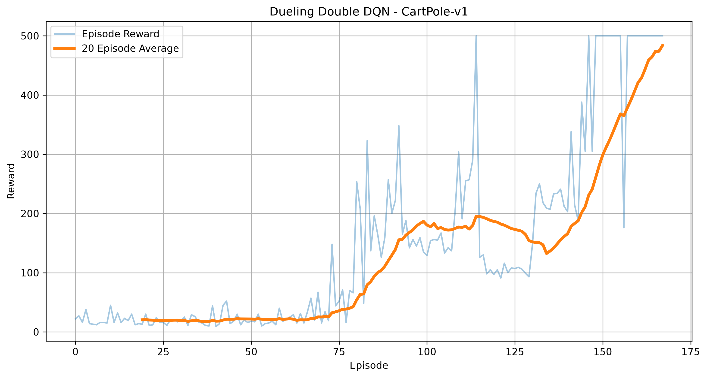
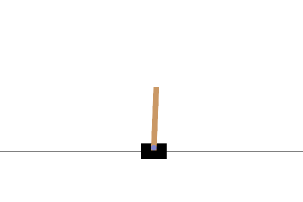

# Dueling Double DQN for CartPole-v1


## Overview

This project implements a **Dueling Double Deep Q-Network (DQN)** agent using **PyTorch** to solve the **CartPole-v1** environment from Gymnasium.

The agent learns to balance a pole on a moving cart through reinforcement learning by interacting with the environment, storing experiences in a replay buffer, and optimizing a neural network using the Bellman equation with Double DQN targets.

---

## Features

- Dueling Network Architecture (separate Value and Advantage streams)
- Double DQN (decoupled action selection and evaluation)
- Experience Replay Buffer with warm-up period
- Soft (Polyak) Target Network Updates
- Epsilon-Greedy Exploration with per-step decay
- Gradient Clipping for training stability
- Automatic Best Model Saving
- Reward Visualization
- Gameplay GIF Generation
- Modular Project Structure
- GPU Support (CUDA if available)

---

## Project Structure

```text
DQN-CartPole/
│
├── assets/
│   ├── gameplay.gif
│   └── reward_plot.png
│
├── models/
│   ├── dqn_cartpole_best.pth
│   └── dqn_cartpole_final.pth
│
├── src/
│   ├── agent.py
│   ├── network.py
│   ├── replay_buffer.py
│   └──trainer.py
│   
│    
│
├── train.py
├── play.py
├── requirements.txt
├── README.md
└── .gitignore
```

---

## Technologies Used

- Python
- PyTorch
- Gymnasium
- NumPy
- Matplotlib
- ImageIO

---

## Reinforcement Learning Pipeline

```text
Environment
   ↓
State
   ↓
Policy Network (Dueling)
   ↓
Epsilon-Greedy Action Selection
   ↓
Environment Step
   ↓
Replay Buffer (with warm-up)
   ↓
Mini-Batch Sampling
   ↓
Double DQN Bellman Target
   ↓
Huber Loss + Gradient Clipping
   ↓
Soft Target Network Update (every step)
   ↓
Repeat
```

---

## Neural Network Architecture

The network shares a feature extractor and splits into two streams, whose outputs are recombined into Q-values:

```text
Input (State = 4)
   ↓
Linear (4 → 128) → ReLU
   ↓
Linear (128 → 128) → ReLU
   ↓
        ┌────────────┴────────────┐
        ↓                         ↓
  Value Stream              Advantage Stream
  Linear (128 → 64) → ReLU   Linear (128 → 64) → ReLU
  Linear (64 → 1)             Linear (64 → action_size)
        ↓                         ↓
        └───────────┬─────────────┘
                     ↓
   Q(s,a) = V(s) + (A(s,a) − mean(A(s,·)))
```

---

## Hyperparameters

| Parameter | Value |
|-----------|------:|
| Episodes (max) | 500 |
| Optimizer | Adam |
| Learning Rate | 5e-4 |
| Gamma | 0.99 |
| Batch Size | 64 |
| Replay Buffer Size | 200,000 |
| Replay Warm-up | 1,000 transitions |
| Initial Epsilon | 1.0 |
| Minimum Epsilon | 0.01 |
| Epsilon Decay | 0.999 (per training step) |
| Target Update | Soft update (τ = 0.005), every training step |
| Gradient Clipping | Max norm 1.0 |
| Loss Function | Huber Loss (SmoothL1Loss) |

---

## Installation

Clone the repository

```bash
git clone https://github.com/Manav0401/DQN-CartPole.git
```

Move into the project

```bash
cd DQN-CartPole
```

Create and activate a virtual environment (optional but recommended)

```bash
python -m venv .venv
# Windows
.venv\Scripts\activate
# macOS/Linux
source .venv/bin/activate
```

Install dependencies

```bash
pip install -r requirements.txt
```

---

## Training

Train the agent using:

```bash
python train.py
```

During training the project automatically:

- Fills the replay buffer before learning begins
- Updates the policy network via Double DQN Bellman targets
- Soft-synchronizes the target network every step
- Saves the best-performing model to `models/dqn_cartpole_best.pth`
- Saves the final model to `models/dqn_cartpole_final.pth`
- Generates a reward plot at `assets/reward_plot.png`
- Stops early if the environment is solved (20-episode average reward ≥ 475)

---

## Evaluation

Run the trained agent:

```bash
python play.py
```

The evaluation script:

- Loads the best trained model (`models/dqn_cartpole_best.pth`)
- Plays 10 episodes of CartPole autonomously (greedy policy, no exploration)
- Records the best-performing episode
- Saves it as `assets/gameplay.gif`

---

## Training Results

The agent reliably reaches the maximum episode reward of **500** and solves the environment (20-episode average ≥ 475) well before the 500-episode budget is exhausted, typically within the first ~150–200 episodes.

---

## Reward Curve



---

## Gameplay



---

## Key Concepts Implemented

- Deep Reinforcement Learning
- Dueling Network Architecture
- Double DQN
- Bellman Equation
- Experience Replay with Warm-up
- Soft (Polyak) Target Network Updates
- Epsilon-Greedy Exploration
- Gradient Clipping
- Function Approximation with Neural Networks

---

## Author

**Manav M George**

Integrated M.Tech in Artificial Intelligence
VIT Bhopal University

GitHub: https://github.com/Manav0401

---