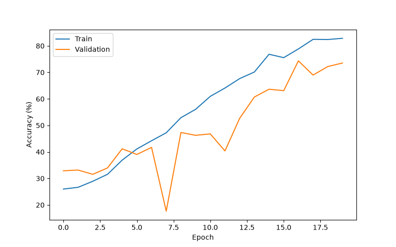
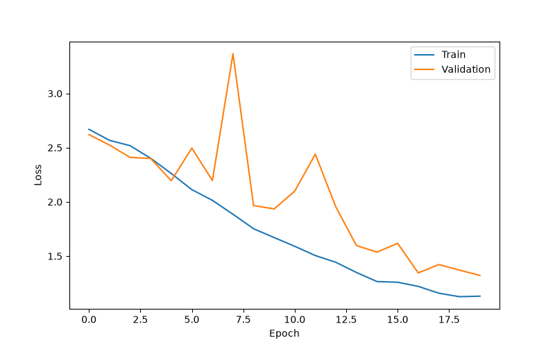

# Face Recognition using Custom CNN (PyTorch)

A deep learning-based face recognition system developed using a custom Convolutional Neural Network (CNN) in PyTorch. The model is trained from scratch on the LFW (Labeled Faces in the Wild) dataset to recognize known individuals.

---

## Features

- Custom CNN architecture built from scratch
- Face recognition using PyTorch
- Data augmentation for improved generalization
- Batch Normalization and Dropout
- Adaptive Average Pooling
- AdamW optimizer with weight decay
- Learning rate scheduler
- Automatic best model saving
- Training history visualization
- Image prediction support

---

## Project Structure

```
Face_Recognition/
│
├── datasets/
│   └── README.md
│
├── saved_model/
│   └── face_cnn.pth
│
├── results/
│   ├── accuracy.png
│   └── loss.png
│
├── test/
│   └── test.jpg
│
├── train.py
├── predict.py
├── plot_metrics.py
├── history.json
├── requirements.txt
├── README.md

```

---

## Dataset

Dataset Used:

**LFW (Labeled Faces in the Wild)**

The dataset was filtered to include only identities with a sufficient number of images for training a custom CNN.

---

## Model Architecture

The custom CNN consists of:

- Conv2D (32 Filters)
- Batch Normalization
- ReLU
- Max Pooling

- Conv2D (64 Filters)
- Batch Normalization
- ReLU
- Max Pooling

- Conv2D (128 Filters)
- Batch Normalization
- ReLU
- Max Pooling

- Conv2D (256 Filters)
- Batch Normalization
- ReLU
- Max Pooling

- Conv2D (512 Filters)
- Batch Normalization
- ReLU

- Adaptive Average Pooling

- Fully Connected Layer (512)
- Dropout

- Fully Connected Layer (256)
- Dropout

- Output Layer

---

## Training Configuration

| Parameter | Value |
|-----------|-------|
| Framework | PyTorch |
| Image Size | 160 × 160 |
| Optimizer | AdamW |
| Loss Function | CrossEntropyLoss |
| Epochs | 20 |
| Batch Size | 64 |
| Learning Rate | 0.001 |

---

## Training Accuracy

<p align="center">
  
</p>

---

## Training Loss

<p align="center">
  
</p>

## Results

- Training Accuracy: **82.85%**
- Validation Accuracy: **74.33%**

---

## Install Requirements

```bash
pip install -r requirements.txt
```

---

## Train the Model

```bash
python train.py
```

---

## Predict Face

Place an image inside the **test** folder.

Run:

```bash
python predict.py
```

Example Output

```
Predicted Person : George_W_Bush

Confidence : 91.42%
```

---

## Training Graphs

The project generates:

- Accuracy Graph
- Loss Graph

using

```bash
python plot_metrics.py
```

---

## Technologies Used

- Python
- PyTorch
- Torchvision
- NumPy
- Matplotlib
- Pillow

---

## Future Improvements

- Real-time webcam recognition
- Face detection using OpenCV
- Support for unknown face detection
- Larger face datasets
- Transfer Learning using ResNet or EfficientNet

---

## Author

**Manav M George**

Integrated M.Tech Artificial Intelligence

VIT Bhopal University
