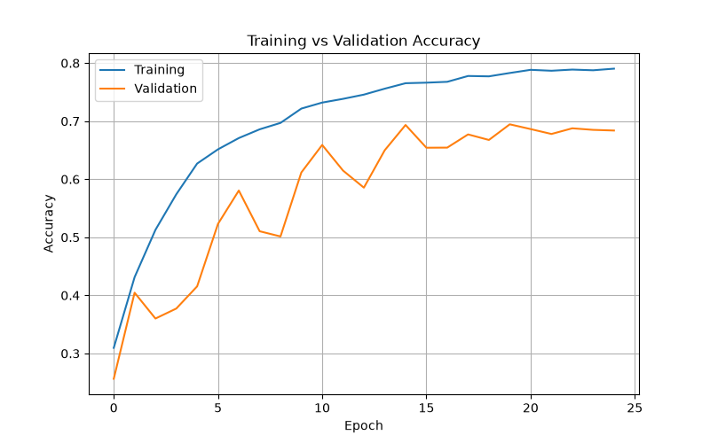
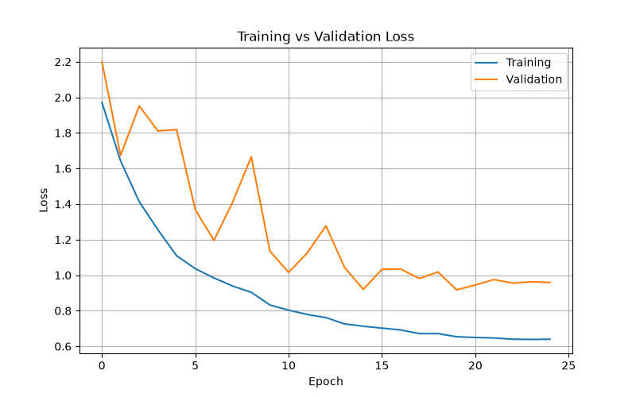

# 🐾 Animal Image Classification using Custom CNN


---

# 📌 Project Overview

This project classifies images of **10 different animal species** using a **Custom Convolutional Neural Network (CNN)** built from scratch with TensorFlow and Keras.

Unlike transfer learning approaches, this model learns image features directly from the dataset without using any pretrained networks.

The project demonstrates the complete deep learning pipeline including dataset preprocessing, data augmentation, CNN architecture design, model training, prediction, and performance visualization.

---

# ✨ Features

- Custom CNN Architecture
- Image Classification of 10 Animal Classes
- Data Augmentation
- Batch Normalization
- Dropout Regularization
- EarlyStopping
- ModelCheckpoint
- ReduceLROnPlateau
- Prediction on Custom Images
- Accuracy & Loss Graphs

---

# 📁 Project Structure

```text
Animal-Image-Classification-CNN/
│
├── README.md
│
├── dataset/
│   └── README.md
│
├── saved_model/
│   └── README.md
│
├── results/
│   ├── accuracy.png
│   └── loss.png
│
├── test/
│   └── download.jpg
│
├── train.py
├── predict.py
├── plot_metrics.py
├── history.json
├── requirements.txt
```

---

# 📂 Dataset

This project uses the **Animals-10 Dataset** available on Kaggle.

Download Dataset:

https://www.kaggle.com/datasets/alessiocorrado99/animals10

After downloading, extract the dataset and place the **raw-img** folder inside:

```text
dataset/
└── raw-img/
```

---

# 🧠 CNN Architecture

The model consists of:

- Input Layer
- Data Augmentation
- Rescaling Layer
- Conv2D (32 Filters)
- Batch Normalization
- MaxPooling
- Conv2D (64 Filters)
- Batch Normalization
- MaxPooling
- Conv2D (128 Filters)
- Batch Normalization
- MaxPooling
- Conv2D (128 Filters)
- Batch Normalization
- MaxPooling
- Global Average Pooling
- Dense (256)
- Dropout
- Dense (128)
- Dropout
- Softmax Output Layer

---

# 📊 Training Results

| Metric | Value |
|---------|-------|
| Training Accuracy | **79.0%** |
| Best Validation Accuracy | **69.5%** |
| Optimizer | Adam |
| Loss Function | Sparse Categorical Crossentropy |

---

# 🚀 Technologies Used

- Python
- TensorFlow
- Keras
- NumPy
- Matplotlib
- Google Kaggle Notebook
- VS Code

---

# 📈 Accuracy Graph



---

# 📉 Loss Graph



---

# ⚙️ Installation

Clone the repository:

```bash
git clone https://github.com/Manav0401/Animal-Image-Classification-CNN.git

cd Animal-Image-Classification-CNN
```

Install dependencies:

```bash
pip install -r requirements.txt
```

---

# ▶️ Train the Model

```bash
python train.py
```

---

# 🔍 Predict an Image

Place your image inside the **test** folder and run:

```bash
python predict.py
```

---

# 📈 Plot Training Metrics

```bash
python plot_metrics.py
```

The generated graphs will be saved inside:

```text
results/
```

---

# 📌 Future Improvements

- Increase classification accuracy using deeper CNN architectures
- Experiment with different optimizers and learning rate schedulers
- Add confusion matrix visualization
- Deploy the model as a web application using Flask or Streamlit
- Compare the custom CNN with transfer learning models such as ResNet50 and EfficientNet

---

# 👨‍💻 Author

**Manav M George**

Integrated M.Tech in Artificial Intelligence  
VIT Bhopal University

GitHub: https://github.com/Manav0401

---
