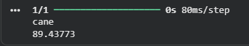
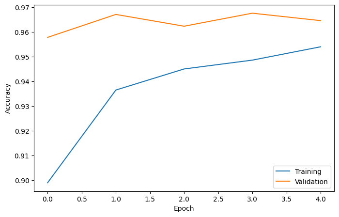
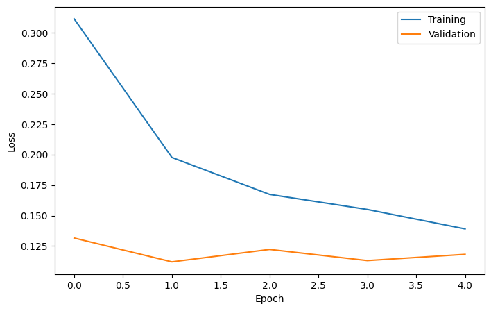

# 🐾 Animal Image Classification using ResNet50


## 📌 Project Overview

This project classifies 10 different animal species using Transfer Learning with ResNet50. The model is trained on the Animals-10 dataset and achieves approximately **96.7% validation accuracy**.

## ✨ Features

- Classifies 10 different animal species
- Uses Transfer Learning with ResNet50
- Data Augmentation
- EarlyStopping
- ModelCheckpoint
- Predicts custom images
- Training & Validation accuracy graphs

---

## 📁 Project Structure

```text
IMAGE-CLASSIFICATION/
│
├── README.md
├── dataset/
│   └── README.md
├── saved_model/
│   └── README.md
├── results/
│   ├── accuracy.png
│   └── loss.png
├── test/
│   └── sample_image.jpg
├── train.py
├── predict.py
├── plot_metrics.py
├── history.json
├── requirements.txt
└── .gitignore
```

---

## 📂 Dataset

This project uses the **Animals-10** dataset from Kaggle.

Download: https://www.kaggle.com/datasets/alessiocorrado99/animals10

---

## 🧠 Model

The project uses **ResNet50** pretrained on the ImageNet dataset as the feature extractor.

The final classification head was customized for **10 animal classes** and trained using Transfer Learning.

Training techniques used:

- Transfer Learning
- Data Augmentation
- EarlyStopping
- ModelCheckpoint

---

## 📊 Results

| Metric | Value |
|--------|------:|
| Training Accuracy | **95.4%** |
| Validation Accuracy | **96.7%** |
| Best Validation Accuracy | **96.8%** |

---

## 🚀 Technologies

- Python
- TensorFlow
- Keras
- NumPy
- Matplotlib
- Google Colab
- VS Code

---

## 📷 Sample Prediction



---

## 📈 Accuracy Graph



---

## 📉 Loss Graph



---

## ⚙️ Installation

```bash
git clone https://github.com/Manav0401/Image-Classification.git

cd Image-Classification
```

---

## ▶️ Run

```bash
pip install -r requirements.txt
python train.py
python predict.py
```