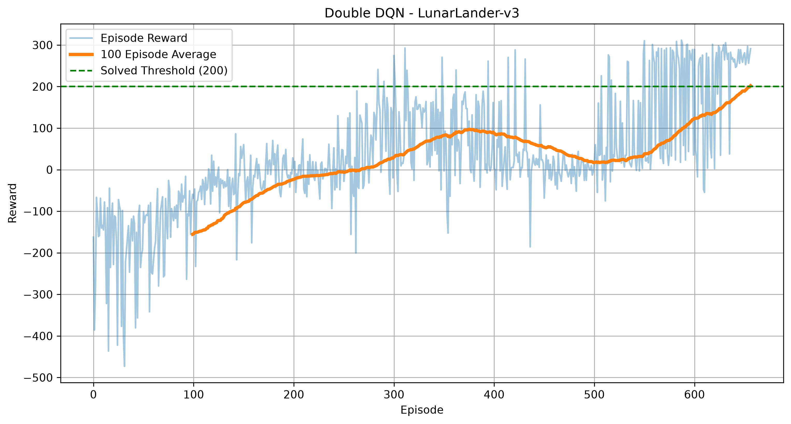
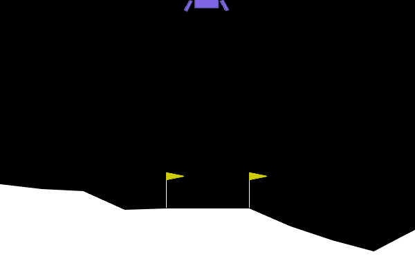

# LunarLander-v3: Double Deep Q-Network (Double DQN)


## Overview

This project implements a **Double Deep Q-Network (Double DQN)** agent using **PyTorch** to solve the **LunarLander-v3** environment from Gymnasium.

The agent learns to safely land a spacecraft between two flags through reinforcement learning, entirely through trial-and-error interaction with the environment — no pre-collected dataset, no demonstrations, no reward shaping beyond what the environment provides.

---

## Environment

**Environment:** LunarLander-v3
**Library:** Gymnasium (requires the `box2d` physics extra)

| | |
|---|---|
| State Space | 8 continuous observations |
| Action Space | 4 discrete actions |

### State Variables

- Horizontal Position
- Vertical Position
- Horizontal Velocity
- Vertical Velocity
- Lander Angle
- Angular Velocity
- Left Leg Ground Contact
- Right Leg Ground Contact

### Available Actions

| Action | Description |
|---------|-------------|
| 0 | Do Nothing |
| 1 | Fire Left Engine |
| 2 | Fire Main Engine |
| 3 | Fire Right Engine |

---

## Algorithm

This project implements **Double Deep Q-Network (Double DQN)**.

Standard DQN uses the same network to both *select* the best next action and *evaluate* its value, which systematically overestimates Q-values (the max operator is biased upward under noisy estimates). Double DQN fixes this by decoupling the two steps: the **policy network** picks the best action, and the **target network** evaluates it.

### Key Features

- Double Deep Q-Network (Double DQN)
- Experience Replay with a warm-up period
- Hard Target Network updates (every N training steps)
- Epsilon-Greedy Exploration (decayed once per episode)
- Huber Loss (Smooth L1 Loss)
- Gradient Clipping
- Adam Optimizer
- Automatic Best Model Saving
- Reward Visualization
- Gameplay GIF Generation
- GPU Support (CUDA if available)

---

## Neural Network Architecture

```text
Input (State = 8)
   ↓
Linear (8 → 256) → ReLU
   ↓
Linear (256 → 256) → ReLU
   ↓
Linear (256 → 4)
   ↓
Q-values
```

---

## Hyperparameters

| Parameter | Value |
|------------|--------|
| Episodes (max) | 1000 |
| Optimizer | Adam |
| Learning Rate | 1e-3 |
| Gamma | 0.99 |
| Batch Size | 128 |
| Replay Buffer Size | 100,000 |
| Replay Warm-up | 5,000 transitions |
| Initial Epsilon | 1.0 |
| Minimum Epsilon | 0.01 |
| Epsilon Decay | 0.995 (once per episode) |
| Target Network Update | Hard copy, every 1,000 training steps |
| Gradient Clipping | Max norm 1.0 |
| Loss Function | Huber Loss (SmoothL1Loss) |
| Solve Criterion | Avg reward ≥ 200 over last 100 episodes |

> **Design notes:** a plain `Adam` optimizer is used rather than `AdamW`, since `AdamW`'s default weight decay silently shrinks Q-values and fights the learning signal. A 5,000-transition warm-up period ensures training doesn't start on a handful of highly correlated, mostly-random early transitions. Epsilon decays once per episode (not per step) because LunarLander episode lengths vary far more than CartPole's, making per-step decay hard to tune. The target network is hard-copied every 1,000 *training* steps rather than soft-updated, matching the original Double DQN paper's approach.

---

## Project Structure

```text
LunarLander-Double-DQN/
│
├── assets/
│   ├── lunarlander_rewards.png
│   └── lunarlander_agent.gif
│
├── models/
│   ├── lunarlander_ddqn.pth
│   └── lunarlander_ddqn_final.pth
│
├── src/
│   ├── network.py
│   ├── replay_buffer.py
│   ├── agent.py
│   └── trainer.py
│
├── train.py
├── play.py
├── requirements.txt
└── README.md

```

---

## Training Procedure

1. Initialize the LunarLander-v3 environment.
2. Create the policy network and target network (identical weights at start).
3. Collect experience using epsilon-greedy exploration.
4. Store each transition in the replay buffer.
5. Once the buffer has enough transitions (past the warm-up threshold), sample random mini-batches and train the policy network using Double DQN targets.
6. Hard-copy the policy network's weights into the target network every 1,000 training steps.
7. Decay epsilon once at the end of each episode.
8. Save the best-performing model (highest 100-episode rolling average) as training progresses.
9. Stop early once the environment is solved (100-episode average reward ≥ 200), otherwise run the full 1,000 episodes.
10. Generate the training reward curve.

---

## Results

Typical training progression on LunarLander-v3:

| Training Stage | Average Reward |
|----------------|----------------|
| Initial Episodes | -300 to -100 |
| Intermediate Training | -100 to 100 |
| Advanced Training | 100 to 250 |
| Solved Environment | Average Reward ≥ 200 (over 100 episodes) |

LunarLander is a meaningfully harder environment than CartPole — the agent typically needs a large fraction of the 1,000-episode budget before the rolling average climbs consistently past the 200 threshold, and progress can be noisy along the way.

The trained model is saved automatically as:

```text
models/lunarlander_ddqn.pth
```

with the final-episode weights also saved separately as:

```text
models/lunarlander_ddqn_final.pth
```

---

## Visualization

### Reward Curve



### Trained Agent



---

## Libraries Used

- Python
- PyTorch
- Gymnasium (with the `box2d` extra)
- NumPy
- Matplotlib
- ImageIO
- tqdm

---

## Installation

Clone the repository.

```bash
git clone https://github.com/Manav0401/Lunar-Lander-RL-Agent-Training.git
cd LunarLander-Double-DQN
```

Create and activate a virtual environment (optional but recommended).

```bash
python -m venv .venv
# Windows
.venv\Scripts\activate
# macOS/Linux
source .venv/bin/activate
```

Install the required dependencies.

```bash
pip install -r requirements.txt
```

> `gymnasium[box2d]` is required — LunarLander uses Box2D physics and will not run without it.

---

## Training

Train the Double DQN agent.

```bash
python train.py
```

During training the project automatically:

- Warms up the replay buffer before learning begins
- Trains the policy network on Double DQN targets
- Hard-syncs the target network every 1,000 training steps
- Saves the best-performing model to `models/lunarlander_ddqn.pth`
- Saves the final model to `models/lunarlander_ddqn_final.pth`
- Generates a reward plot at `assets/lunarlander_rewards.png`
- Stops early if the environment is solved (100-episode average ≥ 200)

---

## Evaluate the Trained Agent

Render the trained model.

```bash
python play.py
```

The evaluation script:

- Loads the best trained model (`models/lunarlander_ddqn.pth`)
- Plays 10 episodes autonomously (greedy policy, no exploration)
- Records the best-performing episode
- Saves it as a looping GIF at `assets/lunarlander_agent.gif`

---

## Future Improvements

- Dueling Double DQN
- Prioritized Experience Replay
- Noisy Networks for Exploration
- Soft Target Updates (Polyak Averaging) as an alternative to hard sync
- Learning Rate Scheduler
- Multi-Step (N-step) Returns

---

## References

- Mnih et al. (2015), *Human-level Control through Deep Reinforcement Learning*
- van Hasselt et al. (2016), *Deep Reinforcement Learning with Double Q-learning*
- Gymnasium Documentation: https://gymnasium.farama.org/

---

## Author

**Manav M George**

Integrated M.Tech in Artificial Intelligence
VIT Bhopal University
