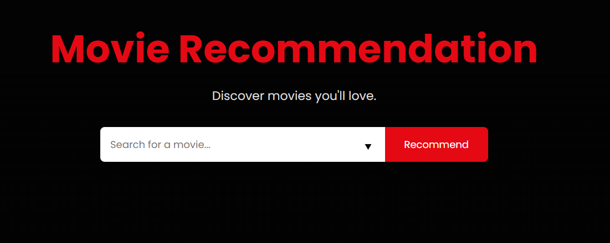
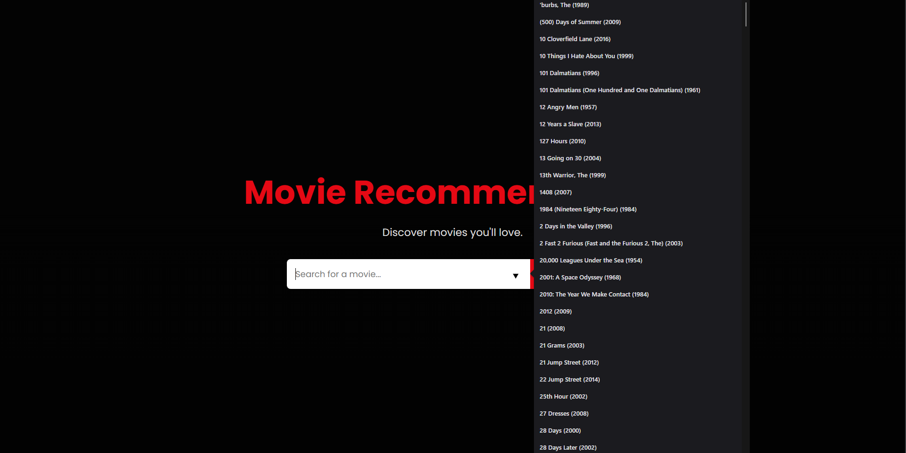
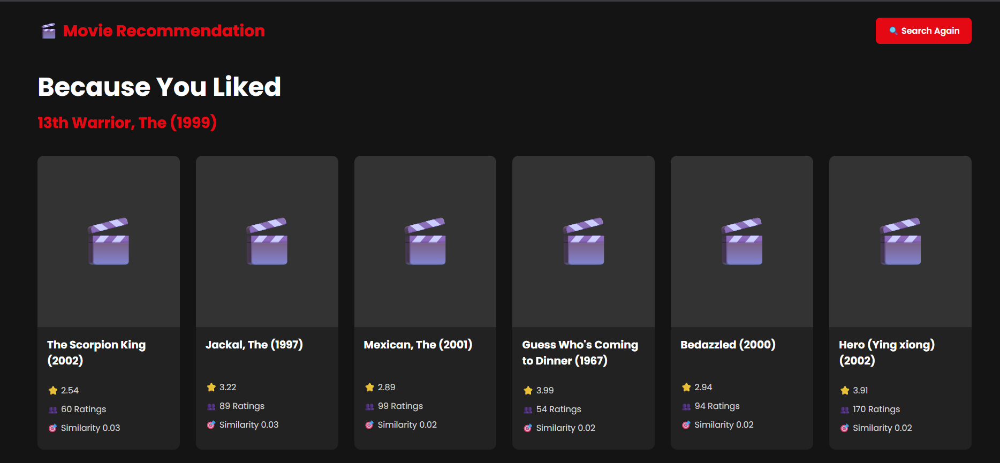

# 🎬 Movie Recommendation System

<p align="center">


</p>

A **Movie Recommendation System** built using **Python**, **Flask**, and **Machine Learning**. The application recommends movies using **Item-Based Collaborative Filtering** with **Cosine Similarity** on the **MovieLens 25M Dataset**.

---

# 📸 Application Preview

## 🏠 Home Page

<p align="center">

</p>

---

## 🔍 Search Page

<p align="center">

</p>

---

## 🎬 Recommendation Page

<p align="center">

</p>

---

# ✨ Features

- 🎥 Search from thousands of movies
- 🤝 Item-Based Collaborative Filtering
- ⭐ Displays average movie ratings
- 👥 Displays rating count
- 🔍 Search autocomplete
- 🎨 Netflix-inspired responsive UI
- ⚡ Fast recommendations using a precomputed similarity matrix

---

# 🛠️ Technologies Used

| Category | Technologies |
|-----------|--------------|
| Programming Language | Python |
| Framework | Flask |
| Machine Learning | Scikit-learn |
| Data Processing | Pandas, NumPy |
| Recommendation Algorithm | Cosine Similarity |
| Frontend | HTML5, CSS3 |

---

# 📂 Dataset

This project uses the **MovieLens 25M Dataset**.

**Dataset Source**

https://www.kaggle.com/datasets/parasharmanas/movie-recommendation-system

To improve performance during development and deployment, a representative sample of the ratings dataset is used while preserving recommendation quality.

**Note:** The dataset is **not included** in this repository
---

# 📁 Project Structure

```text
movie-recommendation-system/
│
├── dataset/
│   ├── movies.csv
│   └── ratings.csv
│
├── model/
│   ├── similarity.pkl
│   ├── movies.pkl
│   └── movie_list.pkl
│
├── static/
│   ├── css/
│   │   └── style.css
│   └── images/
│       ├── homepage.png
│       ├── search.png
│       └── recommendation.png
│
├── templates/
│   ├── index.html
│   └── recommendations.html
│
├── app.py
├── recommender.py
├── train.py
├── requirements.txt
└── README.md
```

---

# 🧠 Machine Learning Pipeline

```text
MovieLens Dataset
        │
        ▼
Data Preprocessing
        │
        ▼
Movie Statistics
        │
        ▼
Movie–User Rating Matrix
        │
        ▼
Cosine Similarity Matrix
        │
        ▼
Recommendation Engine
        │
        ▼
Flask Web Application
```

---

# 🚀 Installation

Clone the repository

```bash
git clone https://github.com/Manav0401/Movie-Recommendation-system.git
```

Move into the project

```bash
cd Movie-Recommendation-system
```

Install the required packages

```bash
pip install -r requirements.txt
```

---

# ⚙️ Train the Recommendation Model

Run:

```bash
python train.py
```

This generates:

```text
model/
├── similarity.pkl
├── movies.pkl
└── movie_list.pkl
```

---

# ▶️ Run the Application

```bash
python app.py
```

Open your browser and visit:

```text
http://127.0.0.1:5000
```

---

# 🧩 Recommendation Technique

The recommendation engine uses **Item-Based Collaborative Filtering**.

### Workflow

1. Load MovieLens dataset
2. Merge movie and rating data
3. Filter movies with sufficient ratings
4. Create a Movie-User Rating Matrix
5. Compute Cosine Similarity
6. Recommend the Top 10 most similar movies

---

# 👨‍💻 Author

**Manav M George**

Integrated M.Tech (Artificial Intelligence)

VIT Bhopal University

GitHub: **https://github.com/Manav0401**